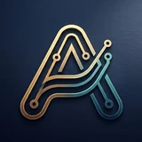
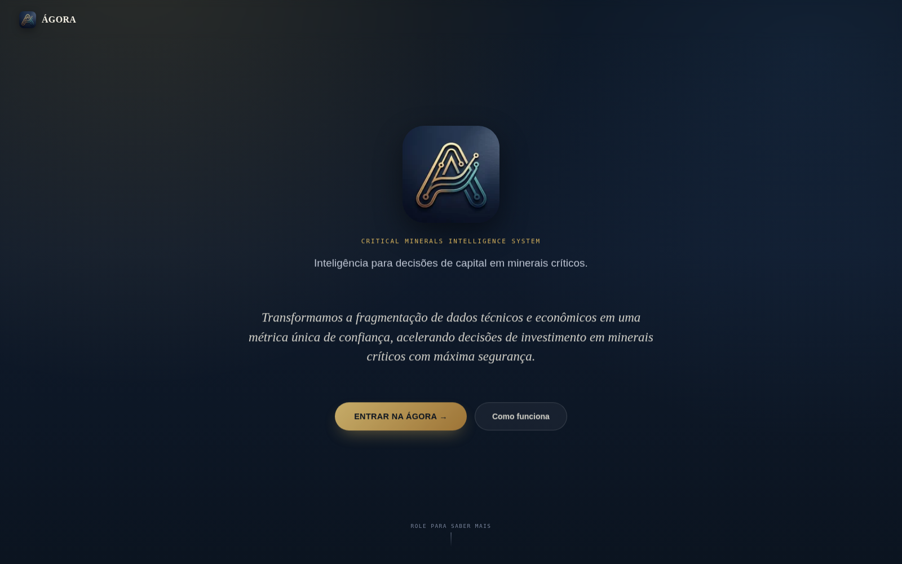
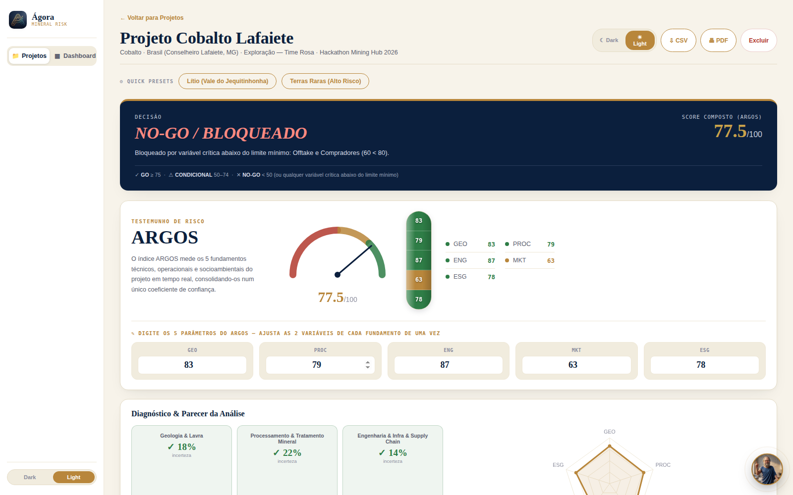
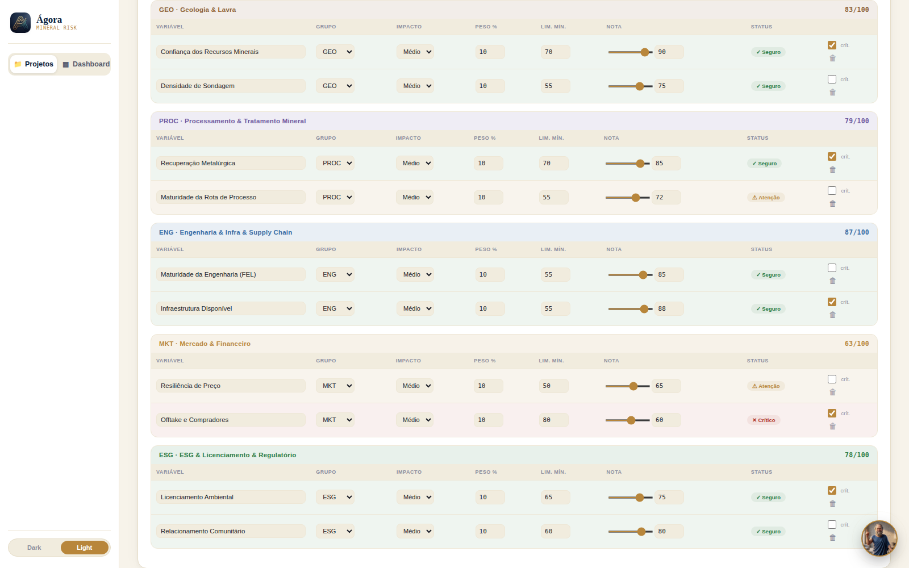
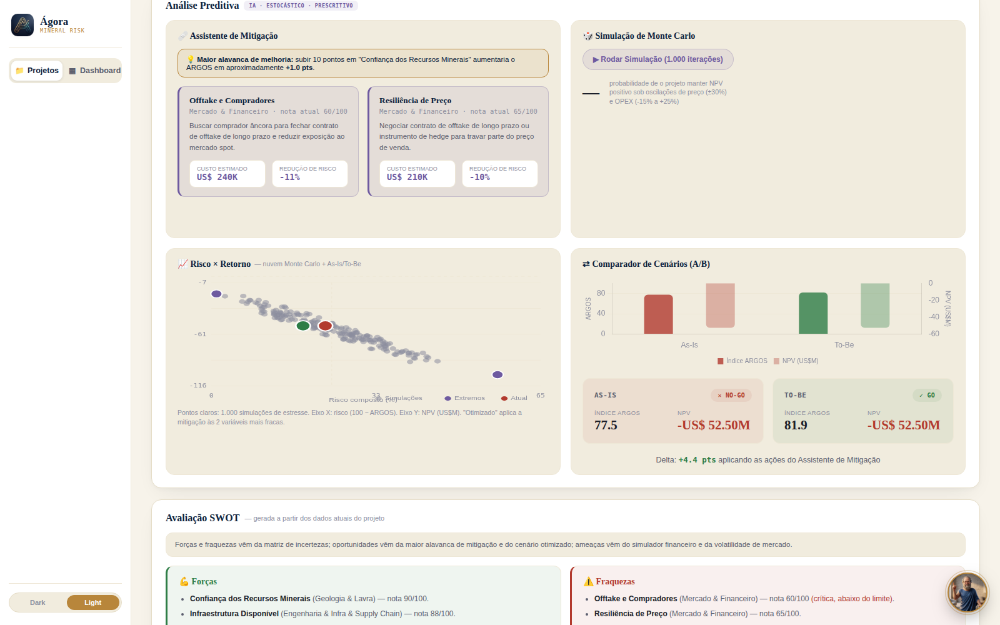
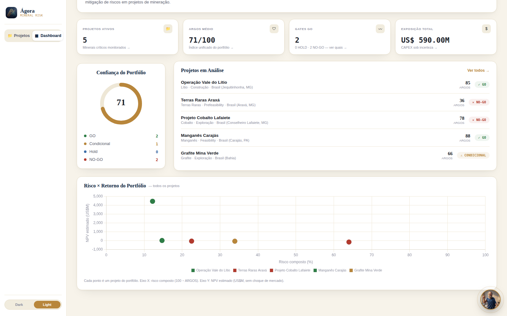

<div align="center">



# ÁGORA
### Critical Minerals Intelligence System

**Transformamos incerteza em decisão.**

Índice único de confiança (**ARGOS**) para projetos de minerais críticos — unifica Geologia, Processamento, Engenharia, Mercado e ESG numa recomendação de investimento auditável: `GO` · `CONDICIONAL` · `HOLD` · `NO-GO`.

Time Rosa — Desafio 4 (Redução de riscos em projetos de minerais críticos), Hackathon Mining Hub × ExpoIBRAM 2026.

</div>

---

## Sobre este projeto

Este projeto foi construído durante o **Hackathon Mining Hub — Edição Exposibram 2026**, uma maratona de inovação de apenas 2 dias (22 e 23 de agosto), realizada na sede do Mining Hub em Belo Horizonte, reunindo 60 estudantes de graduação e pós-graduação selecionados para propor soluções para desafios reais do setor de mineração brasileiro.

Com pouquíssimo tempo de elaboração, o desenvolvimento contou com apoio do **Claude (Anthropic)** para acelerar a construção da plataforma, e com o conhecimento técnico trazido de matérias da faculdade pela equipe — a combinação dos dois foi o que tornou viável sair de uma ideia para um MVP funcional, com metodologia própria e interface completa, dentro da janela do hackathon.

---

## Sumário

- [Sobre este projeto](#sobre-este-projeto)
- [O problema](#o-problema)
- [A solução](#a-solução)
- [Como rodar do zero](#como-rodar-do-zero)
- [O que ele faz](#o-que-ele-faz)
- [Os 5 fundamentos, e as variáveis por trás de cada um](#os-5-fundamentos-e-as-variáveis-por-trás-de-cada-um)
- [Decisões de metodologia](#decisões-de-metodologia)
- [O painel, tela por tela](#o-painel-tela-por-tela)
- [Como ele se parece](#como-ele-se-parece)
- [Estrutura do repositório](#estrutura-do-repositório)
- [Modelo de negócio](#modelo-de-negócio)
- [Limitações reconhecidas](#limitações-reconhecidas)
- [O que eu faria com mais tempo](#o-que-eu-faria-com-mais-tempo)
- [Como este projeto foi construído](#como-este-projeto-foi-construído)

---

## O problema

Um projeto de mineral crítico — lítio, terras raras, cobalto, níquel, nióbio, grafita — não é avaliado por uma única pessoa. Ele passa por geólogos, engenheiros de processo, analistas de mercado e especialistas em ESG, e **cada um desses times produz seu próprio relatório, na sua própria régua, sem falar com o relatório dos outros**.

O resultado disso não é falta de informação — muitas vezes é excesso, mas fragmentado: um comitê de investimento recebe uma pasta de estudos técnicos isolados e precisa, sozinho, montar mentalmente o quadro completo antes de decidir. Essa fragmentação — geologia que não conversa com engenharia, engenharia que não conversa com mercado — é o que gera a incerteza real do investimento: não é que os dados não existam, é que ninguém os integrou numa única métrica antes da hora de decidir.

> *"Vários projetos no mundo estão sendo postos em andamento e quem entrar primeiro consegue se colocar no mercado. E o Brasil não pode prescindir disso."*
> — Frederico Bedran, CEO da Associação de Minerais Críticos (AMC), Fórum Estadão Minério Verde — Novo Rumo da Mineração, 20/08/2026

O Brasil tem a matéria-prima — a 2ª maior reserva mundial de terras raras, segundo a IEA — mas converter potencial geológico em ativo investível exige uma camada de confiança técnica e financeira que hoje simplesmente não existe de forma unificada. É essa camada que o ÁGORA constrói.

## A solução

**Transformamos a fragmentação de dados técnicos e econômicos em uma métrica única de confiança, acelerando decisões de investimento em minerais críticos com máxima segurança.**

O ÁGORA não substitui os relatórios técnicos — ele os conecta. Cada fundamento do projeto (Geologia, Processamento, Engenharia, Mercado, ESG) alimenta um índice único, o **ARGOS**, calculado por média ponderada mas com uma regra que uma média sozinha não tem: **nenhuma nota boa em outras áreas esconde um problema fatal em uma área crítica**. Se o offtake não está garantido, ou a licença ambiental está comprometida, o gate trava — mesmo que a geologia e a engenharia estejam excelentes.

A partir disso, a plataforma entrega automaticamente:

- Um **gate de decisão** com justificativa textual, não só um número.
- Um **diagnóstico rastreável**: qual variável exata está puxando a nota para baixo, e por quê.
- **Ações de mitigação** sugeridas, com custo e ganho de pontos estimados.
- **1.000 simulações de Monte Carlo** mostrando a distribuição de risco × retorno sob estresse de mercado.
- Um **comparador As-Is vs. To-Be**, mostrando o efeito de aplicar as mitigações.
- Uma **análise SWOT automática**, gerada a partir dos próprios dados do projeto — não digitada por um analista.
- Um assistente conversacional (**ARGOS Copilot**) que lê os dados da tela e explica qualquer indicador em linguagem natural, sempre encaminhando validação humana especializada para a Athena antes de qualquer decisão de capital.

---

## Como rodar do zero

Não há build, não há backend, não há `npm install` em produção. Qualquer servidor HTTP estático serve:

```bash
git clone <url-deste-repositório>
cd agora-repo

# Opção 1 — Python (já vem em quase qualquer máquina)
python3 -m http.server 8000

# Opção 2 — Node, sem instalar nada globalmente
npx serve .
```

Abra `http://localhost:8000`. Pronto — os 5 projetos de demonstração já vêm carregados.

> **Não abra `index.html` direto com duplo clique (`file://`).** Alguns navegadores bloqueiam a leitura de scripts locais por política de CORS quando o documento não vem de um servidor HTTP, mesmo local. Sirva sempre por HTTP.

**Publicar no GitHub Pages**: Settings → Pages → branch `main` → pasta raiz (`/`). Sem passo de build — a URL pública já funciona.

---

## O que ele faz

| Etapa | O que acontece |
|---|---|
| **Entrada de dados** | Cada projeto tem 10 variáveis (2 por fundamento), cada uma com nota 0–100, peso, e um flag opcional de criticidade com limite mínimo |
| **Cálculo do ARGOS** | Média ponderada das 10 variáveis — mas sujeita à regra de bloqueio por criticidade (ver abaixo) |
| **Gate de decisão** | `GO` / `CONDICIONAL` / `HOLD` / `NO-GO`, com a razão exata escrita por extenso, não só a cor |
| **Diagnóstico** | Mapa de calor de incerteza por fundamento, radar comparativo, e um parecer em texto gerado a partir dos próprios números |
| **Mitigação** | As 2 variáveis mais fracas do projeto recebem uma ação sugerida (biblioteca de regras por padrão de nome), com custo estimado em USD e redução de risco em % |
| **Simulação financeira** | Monte Carlo (1.000 iterações, choque de preço ±30%, choque de OPEX -15%/+25%) → probabilidade de NPV positivo, mais NPV/IRR determinístico com choques manuais |
| **SWOT automático** | Forças, fraquezas, oportunidades e ameaças — todas derivadas dos dados atuais do projeto, não digitadas |
| **Assistente conversacional** | Lê o texto visível da tela + os dados estruturados do projeto aberto, responde em linguagem natural seguindo um protocolo fixo de diagnóstico técnico + encaminhamento humano |
| **Exportação** | CSV da matriz de variáveis, JSON de configuração completa, PDF de resumo executivo via impressão do navegador |

---

## Os 5 fundamentos, e as variáveis por trás de cada um

| Fundamento | Variáveis padrão | O que cada uma mede |
|---|---|---|
| **Geologia & Lavra** | Confiança dos Recursos Minerais · Densidade de Sondagem | O recurso existe e está caracterizado com confiança suficiente? |
| **Processamento & Tratamento Mineral** | Recuperação Metalúrgica · Maturidade da Rota de Processo | A rota metalúrgica recupera o mineral com pureza e escala comercialmente viáveis? |
| **Engenharia & Infra & Supply Chain** | Maturidade da Engenharia (FEL) · Infraestrutura Disponível | O projeto tem maturidade de engenharia e infraestrutura para ser construído? |
| **Mercado & Financeiro** | Resiliência de Preço · Offtake e Compradores | Existe comprador, e o preço resiste a choques de mercado? |
| **ESG & Licenciamento & Regulatório** | Licenciamento Ambiental · Relacionamento Comunitário | O projeto tem licença social e regulatória para operar sem travar no meio do caminho? |

O conjunto de variáveis **não é fixo em código** — é dirigido pelos dados de cada projeto. É possível adicionar, remover, reagrupar ou reponderar qualquer variável diretamente na Matriz de Calor da interface. A visão de produto (ver [slides do pitch](#modelo-de-negócio)) fala em até 25 variáveis distribuídas pelos 5 fundamentos; o que está implementado hoje é o núcleo de 10 — o modelo de dados já suporta a expansão sem mudança de arquitetura.

---

## Decisões de metodologia

Esta seção existe pelo mesmo motivo da seção equivalente em qualquer pipeline de dados sério: as decisões abaixo não são óbvias, e cada uma foi deliberada — não é o "jeito mais simples de programar", é o jeito que corresponde à pergunta de negócio.

### Notas se compõem por média ponderada; a criticidade não é uma taxa, é uma trava

```
ARGOS = Σ (nota_i × peso_i) / Σ (peso_i)
```

Uma média ponderada simples é suficiente para agregar — a sofisticação não está na fórmula, está na regra que vem depois dela. Cada variável pode ser marcada como **crítica**, com um **limite mínimo**. E aqui a plataforma trata duas situações de forma diferente, deliberadamente:

- **Falha dura** (`hardFail`): a nota está **mais de 5 pontos abaixo** do limite mínimo → bloqueio automático, `NO-GO`, independente de qualquer outra nota.
- **Quase-falha** (`nearMiss`): a nota está **abaixo do limite, mas dentro de uma margem de 5 pontos** → o projeto não é descartado, vai para `HOLD` — "há dado insuficiente para aprovar ou reprovar com segurança, colete mais evidência antes de comprometer capital".

Essa distinção existe porque tratar "faltam 2 pontos" e "faltam 30 pontos" da mesma forma (um "NO-GO" genérico) apagaria uma informação que importa na prática: o primeiro caso pede uma nova rodada de sondagem ou uma renegociação de contrato; o segundo pede reformular o projeto. `HOLD` é o gate que separa esses dois mundos.

**Exemplo real, do cenário de demonstração "Projeto Cobalto Lafaiete"**: ARGOS composto de 77,5 (que sozinho estaria na faixa `GO`, ≥ 75), mas a variável crítica *Offtake e Compradores* está em 60 contra um limite de 80 — 20 pontos abaixo, portanto falha dura. Resultado: `NO-GO`, com a razão exibida por extenso na tela, não só a cor vermelha.

### As faixas do score composto

| Faixa (sem variável crítica reprovada) | Decisão |
|---|---|
| ARGOS ≥ 75 | `GO` |
| 60 ≤ ARGOS < 75 | `CONDICIONAL` |
| 45 ≤ ARGOS < 60 | `HOLD` |
| ARGOS < 45 | `NO-GO` |

Qualquer variável crítica em falha dura força `NO-GO` **mesmo que o composto esteja em `GO`**; qualquer variável crítica em quase-falha força pelo menos `HOLD`, mesmo que o composto sozinho apontasse `GO` ou `CONDICIONAL`. A trava de criticidade sempre vence a média — essa hierarquia é o núcleo de governança do produto, e é a razão de o ARGOS não ser "só uma média com nome bonito".

### O comparador As-Is/To-Be muda o ARGOS — mas só muda o NPV se a variável certa for mitigada

Isto não é intuitivo até se testar, então documentamos explicitamente: o cálculo de NPV/IRR da plataforma depende de CAPEX, OPEX, preço, produção e **recuperação metalúrgica** — nenhuma outra variável entra na conta financeira. O Assistente de Mitigação escolhe as **2 variáveis com nota mais baixa** para simular melhoria, que nem sempre incluem Recuperação Metalúrgica.

Consequência prática: se as duas variáveis mais fracas de um projeto forem, por exemplo, *Offtake e Compradores* e *Resiliência de Preço*, o comparador vai mostrar o ARGOS subindo (a confiança geral melhora) mas o **NPV permanecendo idêntico** entre As-Is e To-Be — porque, matematicamente, nada que afeta a taxa de recuperação metalúrgica mudou. Isso é uma consequência correta do modelo, não um bug, mas é fácil de interpretar como um erro visual se não for lido com atenção — por isso está documentado aqui e não escondido.

### Sem persistência é uma escolha de escopo, não um esquecimento

O estado inteiro do app vive em memória JavaScript. Recarregar a página devolve os 5 projetos de demonstração ao seu ponto de partida. Isso foi deliberado para o MVP de hackathon — elimina qualquer dependência de infraestrutura de backend para a apresentação — mas é o primeiro item da lista de [limitações reconhecidas](#limitações-reconhecidas) e a prioridade #1 do roadmap.

### Alguns gráficos usam Chart.js; os mais críticos usam SVG desenhado à mão

O gauge do ARGOS, a nuvem de dispersão de risco×retorno e a curva de distribuição de Monte Carlo **não usam Chart.js** — são construídos como string de SVG e injetados diretamente no DOM. A decisão veio de problemas recorrentes de timing de renderização do Chart.js em ambientes de preview/sandbox durante o desenvolvimento: um gráfico que depende do ciclo de animação interno de uma biblioteca de terceiros pode não aparecer em determinados contextos de exibição. SVG gerado por template string renderiza de forma síncrona e determinística, sem esse risco. Onde esse risco não existia (radar, comparador em barras, dispersão do portfólio), Chart.js foi mantido — não há razão para reescrever o que já funciona.

---

## O painel, tela por tela

A ordem da interface de detalhe do projeto segue a ordem em que um comitê de investimento realmente lê um caso — cada bloco responde a uma pergunta específica:

| Bloco | Pergunta que responde |
|---|---|
| **Banner de decisão** | GO, CONDICIONAL, HOLD ou NO-GO — e por quê, em uma frase, acima da dobra |
| **Testemunho de risco (ARGOS)** | Qual é a nota consolidada, e como ela se distribui entre os 5 fundamentos? |
| **Diagnóstico & parecer** | Onde exatamente está a força e a fraqueza deste projeto, em texto corrido? |
| **5 Etapas da cadeia** | Quero ajustar um fundamento inteiro de uma vez — o que muda? |
| **Matriz de calor** | Quero editar uma variável específica — nome, peso, criticidade, limite — linha por linha |
| **Análise preditiva** | Se eu mitigar os 2 pontos mais fracos, quanto ganho? Sob estresse de mercado, qual a chance de o projeto continuar viável? |
| **SWOT** | Num parágrafo por quadrante, quais são os riscos e oportunidades reais deste projeto específico? |
| **Simulador de estresse** | Quanto este projeto perde por mês de atraso em licenciamento ou engenharia? |

O Dashboard de portfólio (visão agregada de todos os projetos) responde uma camada acima: quantos projetos estão em cada gate, qual a exposição total de capital, e onde cada projeto se posiciona no mapa de risco × retorno do portfólio inteiro.

---

## Como ele se parece

**A tela de entrada** — a proposta de valor em uma frase, antes de qualquer dado.



**O detalhe de um projeto** — este é o caso mais didático dos 5 cenários de demonstração: ARGOS de 77,5 (que sozinho aprovaria), bloqueado em `NO-GO` porque *Offtake e Compradores* está abaixo do limite mínimo. O testemunho de risco mostra exatamente qual dos 5 fundamentos está puxando a nota — no cilindro e na legenda ao lado do gauge.



**A matriz de calor** — cada variável, editável linha a linha, com o status calculado em tempo real. *Offtake e Compradores* aparece marcada como "Crítico" em vermelho — é exatamente essa linha que está bloqueando o gate acima.



**A análise preditiva** — Monte Carlo, mitigação sugerida com custo estimado, comparador As-Is/To-Be e a nuvem de simulações de estresse, todos na mesma tela.



**O dashboard de portfólio** — visão agregada dos 5 projetos, cada um posicionado no mapa de risco × retorno.



---

## Estrutura do repositório

```
agora-repo/
├── README.md                   # Este arquivo
├── IA.md                       # Relatório da IA sobre o próprio processo de desenvolvimento
├── LICENSE
├── package.json
├── index.html                  # Documento principal (estrutura da aplicação)
├── css/styles.css              # Todo o sistema visual — temas claro/escuro, componentes
├── js/
│   ├── app.js                  # Modelo de dados, ARGOS, gate, Monte Carlo, SWOT, assistente
│   └── vendor/                 # Chart.js e Three.js vendorizados — sem dependência de CDN
├── assets/                     # Logo e avatar do assistente
└── docs/
    ├── screenshots/            # Capturas reais da aplicação, usadas neste README
    ├── SPECIFICATION.md        # Especificação técnica: arquitetura, modelo de dados, cada módulo
    ├── ARGOS-METHODOLOGY.md    # A fórmula do índice, com exemplo numérico completo
    └── ROADMAP.md              # MVP vs. produção — o que falta, e em que ordem
```

Documentação técnica aprofundada (arquitetura, API do assistente, limitações módulo a módulo) vive em `docs/`; este README é o ponto de entrada narrativo; `IA.md` é o relato honesto de como o desenvolvimento realmente aconteceu — incluindo os erros no meio do caminho.

---

## Modelo de negócio

Do pitch original apresentado à banca (Time Rosa, Hackathon Mining Hub × ExpoIBRAM 2026):

**Clientes-alvo**: fundos de investimento em transição energética; áreas de novos negócios minerais de mineradoras.

**Licenciamento da plataforma**: SaaS por projeto ou licença corporativa, com dashboards, scores e histórico de decisões versionado.

**Consultoria especializada** (camada humana, via Athena): facilitação de treinamentos técnicos, calibração dos critérios de avaliação por cliente, parecer executivo para comitês de investimento, apoio direto na decisão GO/HOLD/NO-GO.

| Pacote | Valor |
|---|---|
| MRI Básico | R$ 10.000 |
| MRI Completo | R$ 25.000 |
| MRI + Parecer Executivo | R$ 40.000 |

**Custo estimado de implementação do MVP**: desenvolvimento R$ 13.000 + carga da base de dados R$ 7.500 + validação R$ 6.000 + infraestrutura (hospedagem, domínio, backup) R$ 2.000/ano — total R$ 28.500.

> Estes números vêm do material de pitch da equipe e representam a proposta comercial avaliada pela banca, não uma característica técnica do software neste repositório — reproduzidos aqui para que qualquer avaliador tenha o quadro de negócio completo, não só o técnico.

---

## Limitações reconhecidas

Documentadas de propósito, não por serem pontos cegos — são exatamente os itens que qualquer avaliador técnico vai procurar, então é melhor que estejam aqui, com o nível de precisão que cada uma merece:

1. **Sem persistência entre sessões.** Recarregar a página apaga qualquer edição — os 5 projetos de demonstração voltam ao estado original a cada carregamento. Ver [ROADMAP.md](docs/ROADMAP.md#persistência).
2. **Sem autenticação nem isolamento multiusuário.** Qualquer pessoa com o link vê e edita todos os dados.
3. **IRR é uma aproximação linear**, não a solução iterativa exata (Newton-Raphson) da equação de fluxo de caixa. Adequado para comparação visual de cenários no MVP; não para decisão de capital final sem revisão.
4. **O comparador As-Is/To-Be só move o NPV quando a variável mitigada é Recuperação Metalúrgica** — comportamento correto do modelo, mas contraintuitivo se não lido com atenção (ver [Decisões de metodologia](#decisões-de-metodologia)).
5. **O assistente conversacional (ARGOS Copilot) depende de uma camada de proxy/autenticação de API não incluída neste repositório.** O restante da aplicação funciona integralmente sem essa camada; só o chat fica inoperante sem ela.
6. **A biblioteca de ações de mitigação é uma lista estática** casada por padrão de nome da variável (`ACTION_LIBRARY`) — funciona bem para o vocabulário atual de 10 variáveis, mas não generaliza sozinha para nomes totalmente novos sem adicionar a regra correspondente.
7. **Sem testes automatizados versionados.** A lógica de cálculo (`composite`, `gateFor`, `runStress`, `runMonteCarlo`) foi validada manualmente durante o desenvolvimento — não há suíte unitária no repositório ainda.
8. **Os limiares do gate (75/60/45, e a margem de 5 pontos para "quase-falha") são hipóteses de design**, não resultado de calibração contra uma base histórica de projetos reais com desfecho conhecido.

---

## O que eu faria com mais tempo

1. **Persistência real** — backend com banco de dados; sem isso, o produto não sai do estágio de demonstração.
2. **Autenticação + isolamento por organização** — pré-requisito para qualquer piloto com cliente real.
3. **Proxy seguro para a API de IA**, destravando o assistente conversacional fora do ambiente original de desenvolvimento.
4. **IRR exato** — correção pontual, de baixo esforço e alto ganho de credibilidade financeira.
5. **Calibrar os limiares do gate com dados reais ou um painel de especialistas do setor**, em vez das hipóteses de design atuais.
6. **Testes automatizados do motor de cálculo** — é a lógica mais crítica do produto e a mais barata de cobrir com testes unitários; hoje a única validação é manual.
7. **Expandir de 10 para as ~25 variáveis** já descritas na visão de produto original, mantendo a mesma arquitetura de dados (que já suporta isso sem mudança estrutural).

O detalhamento completo, com todos os itens organizados por área (produto, dados, segurança), está em **[docs/ROADMAP.md](docs/ROADMAP.md)**.

---

## Como este projeto foi construído

Este repositório foi desenvolvido com apoio de IA (Claude, Anthropic), ao longo de uma única conversa longa e iterativa com o Time Rosa — não numa sessão única de "gerar e entregar", mas em dezenas de rodadas de ajuste, correção de bugs reais (inclusive alguns graves, como perda de conteúdo entre edições) e revisão de rumo a partir de feedback direto sobre o que estava funcionando e o que não estava.

O relato completo desse processo — incluindo os erros no meio do caminho, os diagnósticos errados antes do certo, e o que ficaria diferente numa segunda vez — está em **[IA.md](IA.md)**. Ele existe pela mesma razão que a seção de limitações reconhecidas: um relatório de desenvolvimento que só mostra o que deu certo é menos útil, para quem for manter este código depois, do que um que mostra também onde as coisas quebraram e como foram encontradas.

---

## Time Rosa

Enzo Henrique · Mariana Maia · Maria Laura · Pedro Vieira · Savia Pessoa

Hackathon Mining Hub × ExpoIBRAM 2026 — Desafio 4: Redução de riscos em projetos de minerais críticos.

## Licença

Protótipo de MVP desenvolvido para avaliação em hackathon. Ver [`LICENSE`](LICENSE) — licença MIT incluída como placeholder; confirme com o Time Rosa/Athena a licença definitiva antes de tornar o repositório público em caráter permanente.
